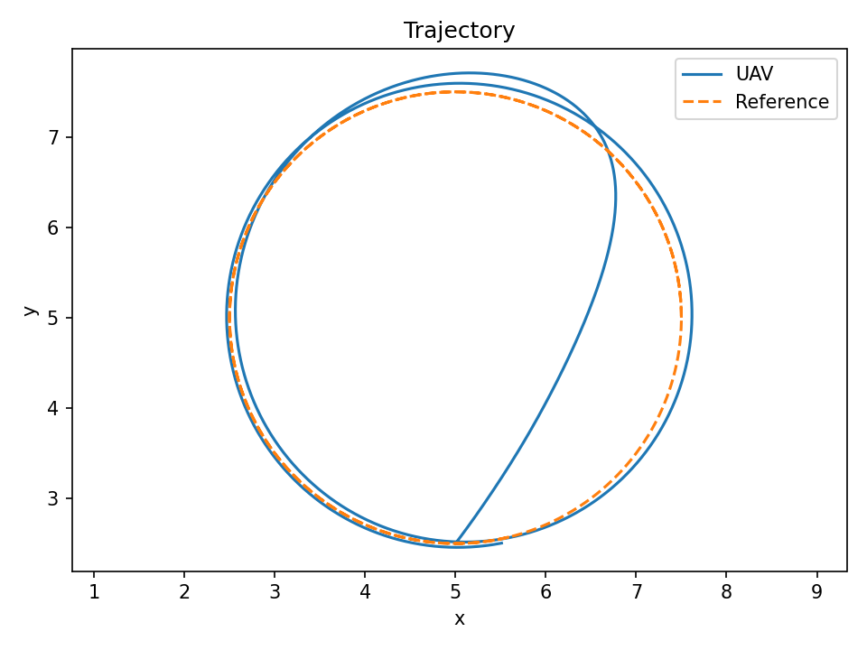
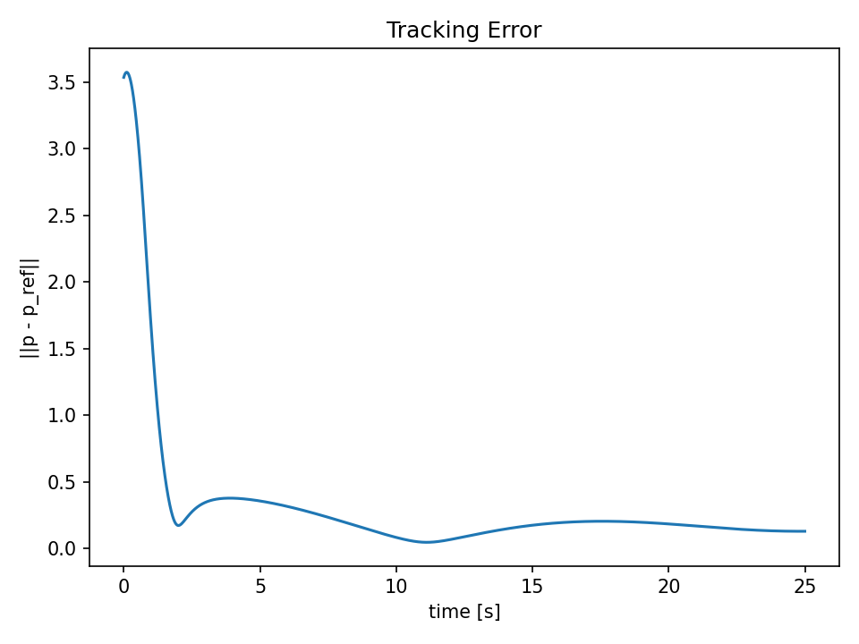
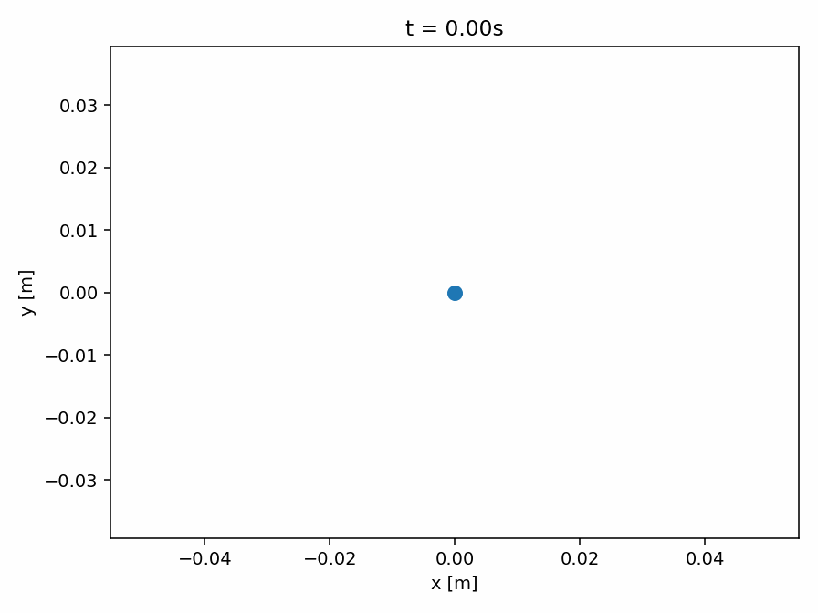
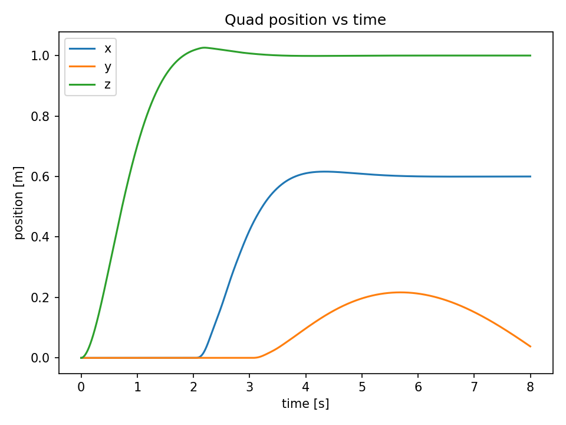
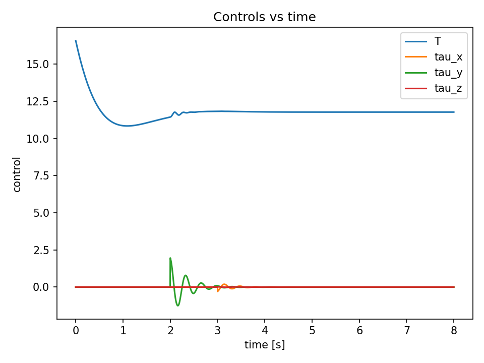
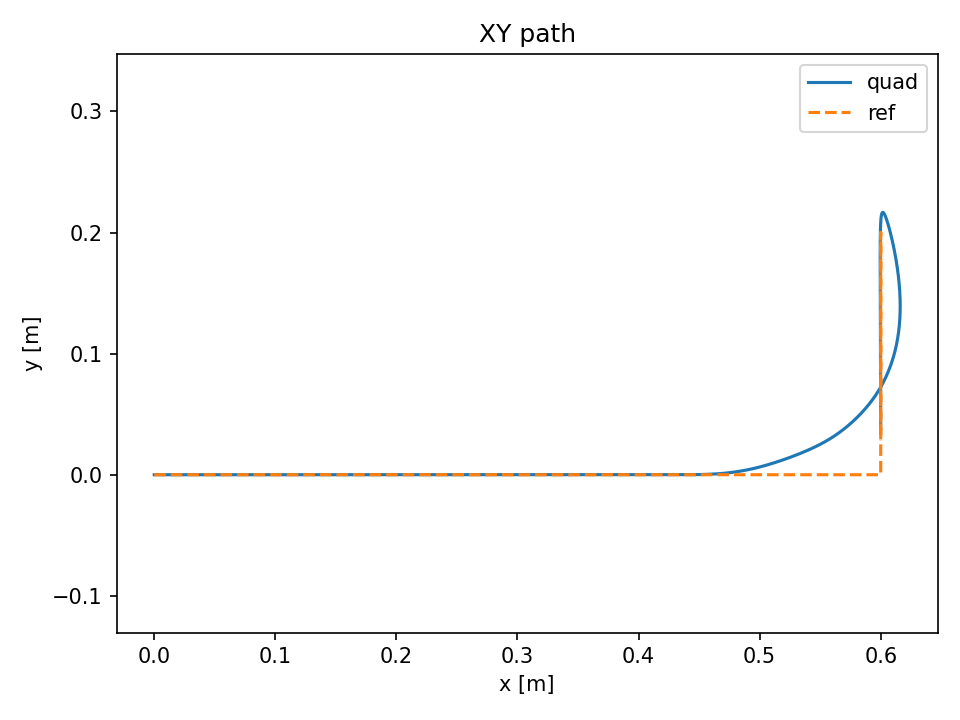

# uav_pde_sim (PyTorch)

Coupled PDE–ODE UAV simulation in PyTorch.

What this repo contains:
- 2D wind field evolving via advection–diffusion PDE on a grid
- 2D point-mass UAV dynamics (ODE) coupled to the wind field
- PID controller for trajectory tracking
- Everything runs in torch (CPU/GPU). Wind sampling uses torch.nn.functional.grid_sample.

Install:
  pip install -r requirements.txt

Run the demo:
  PYTHONPATH=src python experiments/exp_01_pid_vs_wind.py

Outputs saved to assets/:
- trajectory.png
- tracking_error.png
- wind_mag_t*.png

Notes:
- Wind sampling uses a pure-torch bilinear interpolator (periodic wrap) instead of torch.nn.functional.grid_sample.
  Reason: some macOS CPU PyTorch builds can segfault in grid_sample; this avoids that native kernel path.

---

## Results

### 1) PDE Wind Field + Point-Mass UAV (PID Control)

The environment wind field evolves according to a 2D advection–diffusion PDE, while a UAV (modeled as a point mass) tracks a circular reference trajectory under PID control. The UAV samples the wind field and experiences disturbance forces.

**Demo (wind magnitude + UAV + reference):**

**Trajectory tracking (XY):**

**Tracking error vs time:**

---

### 2) Quadrotor Attitude Model (Cascaded Control)

A full 6-DOF quadrotor model with quaternion attitude is simulated using thrust + body torques as inputs. A cascaded controller (position outer loop, attitude inner loop) stabilizes hover and tracks a simple reference trajectory.

**Demo (top-down XY flight path):**

**Position vs time:**

**Control inputs (thrust and torques):**

**XY path vs reference:**

---

## Math & Models

### 1) Wind Field PDE (Environment Model)

The wind field is modeled on a 2D grid as a vector field:

  w(x, y, t) = (w_x(x, y, t), w_y(x, y, t))

and evolves according to an advection–diffusion equation with sources:

  ∂w/∂t + u · ∇w = ν ∇²w + S(x, y, t)

where:
- u is a constant advection velocity,
- ν is the diffusion coefficient,
- S(x, y, t) injects localized gusts (Gaussian sources),
- periodic boundary conditions are used.

The PDE is discretized with finite differences:
- Upwind scheme for the advection term,
- 5-point stencil for the Laplacian,
- Explicit time stepping.

---

### 2) Point-Mass UAV Dynamics (ODE)

The simplified UAV model uses state:

  x = [p_x, p_y, v_x, v_y]

with dynamics:

  p_dot = v  
  v_dot = (1/m) u_ctrl - k (v - w(p, t))

where:
- u_ctrl is the commanded acceleration from the controller,
- w(p, t) is the sampled wind velocity from the PDE field,
- k is a drag/disturbance coupling coefficient.

This ODE is integrated using a 4th-order Runge–Kutta (RK4) method.

---

### 3) Quadrotor Rigid-Body Dynamics

The full quadrotor state is:

  x = [p(3), v(3), q(4), ω(3)]

where:
- p is position, v is velocity (world frame),
- q is a unit quaternion representing attitude,
- ω is body angular velocity.

Translational dynamics:

  p_dot = v  
  v_dot = (1/m) R(q) [0, 0, T]^T - [0, 0, g]^T

Rotational dynamics:

  q_dot = 0.5 * q ⊗ [0, ω]  
  ω_dot = I^{-1} (τ - ω × (I ω))

where:
- R(q) is the rotation matrix from the quaternion,
- T is total thrust,
- τ is the body torque vector,
- I is the inertia matrix.

---

### 4) Control

**Point-mass case:**  
A PID controller tracks position and velocity references:

  u_ctrl = Kp (p_ref - p) + Kd (v_ref - v) + Ki ∫(p_ref - p) dt

**Quadrotor case (cascaded control):**
- Outer loop: computes desired acceleration from position/velocity errors.
- Inner loop: constructs a desired attitude R_des aligning body z with the desired acceleration direction and applies a geometric PD controller on SO(3).
- Thrust is computed by projecting the desired acceleration onto the current body z-axis.

This structure is standard in quadrotor control and demonstrates nonlinear dynamics, attitude representation with quaternions, and coupled translational/rotational control.

---

### 5) Numerical Methods

- PDE: finite differences (upwind advection, central diffusion), explicit time stepping.
- ODEs: explicit Runge–Kutta 4 (RK4).
- Wind sampling: bilinear interpolation on the grid (implemented in pure PyTorch for stability on macOS).

All computations are implemented in PyTorch, enabling future extensions such as batching, GPU acceleration, or differentiable simulation.

